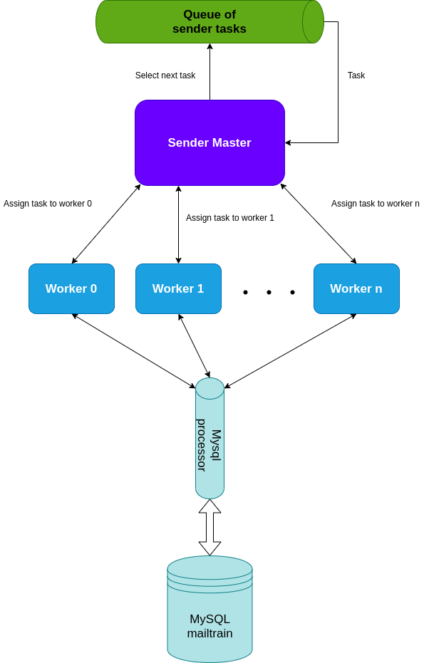

# Architecture shortcomings

In this chapter, we are going to describe the base shortcomings and limits that current architecture contains. It means describing the main bottlenecks in the current architecture, analyzing the components responsible for this. Finally, we will introduce the solution (it includes the distributed architecture of the whole component, distributed architecture for the database, and expected performance).

## The main bottlenecks

As we could expect, sending campaign emails takes the most time. Sender component is responsible for sending all campaign emails.

Here we can see the architecture of Sender component:

    

Here we can see the design of MySQL mailtrain database:

As we can see, the master process takes tasks from the queue (each task includes sending some email from any campaign) and send it balanced to each worker. A worker then makes a formatted email and sends it to the SMTP server which sends it to a receiver.

We have 4 main bottlenecks in our current architecture of Sender:

- SMTP server: The first bottleneck is in the current SMTP server, we use a centralized serial SMTP server for sending emails. So when workers format their emails for sending, then all workers must wait for SMTP server processing.
- Centralized workers: The second bottleneck is that we have already parallel architecture of Sender which runs only on one machine. We have already reached the limit of Amdahl's law and further adding processes (workers) on one machine would only make the situation worse.
- Centralized MySQL: As we can see from the diagram, the third big bottleneck is in a situation, when all workers need to query the same MySQL database.
- Centralized sending attachments: In the current implementation, attachments are sent through the public endpoint by one process. The main problem starts when there are too many simultaneously sent requests from subscribers for sending attachments. It also slows down workers because they work on the same machine and query the same database. It is the last bottleneck that we will solve with a distributed solution.

## Performance tests

For better analyzing each bottleneck described above we are going to look at data from the performance test:

|Workers         |Real time |Worker time |SMTP server time |
|----------------|----------|------------|-----------------|
|1 worker        |2565s     |2561.211s   | 1274.688s       |
|2 workers       |1249s     |1245.976s   | 620.598s        |
|3 workers       |708s      |704.504s    | 401.392s        |
|4 workers       |637s      |635.9s      | 320s            |
|10 workers      |274s      |270.876s    | 142.603s        |
|20 workers      |254s      |250.876s    | 120.603s        |
|30 workers      |282s      |275.876s    | 155.603s        |
|40 workers      |275s      |268.876s    | 172.603s        |
|50 workers      |295s      |286.876s    | 201.176s        |

Each test was run on Intel® Core™ i3-7100U CPU @ 2.40GHz × 4 CPU and one centralized serial SMTP server which was run on the same machine. In each test, we sent 44846 emails for one regular campaign. Real time is the exact time between the start of sending and after sending emails. Worker time is the average time which takes per one worker. SMTP server time is the exact time that takes just sending created and formatted emails. Worker time includes also SMTP server time.

From measured times we can see that real time can be divided in half, where the first half takes SMTP server (for a bigger amount of workers it is a little bit more but only because we use serial SMTP server) and the second half takes other worker computing. It includes mainly database accesses, creating the email, and other details.

Now we are going to look deep at the second half of worker time. This is the exact analysis of time that tells us which functions (queries) take the most time:

<ul>
    <li>processCampaignMessages took 310.076s (service/sender-worker.js)</li>
    <ul>
        <li>initByCampaignId took 6.901s (lib/message-sender.js)</li>
        <li>sendRegularCampaignMessage took 302.136s (lib/message-sender.js)</li>
        <ul>
            <li>sendMessage took 239.087s (lib/message-sender.js)</li>
            <ul>
                <li>getById took 29.538s (lib/subscriptions.js)</li>
                <li>_getMessage took 17.152s (lib/message-sender.js)</li>
                <li>getOrCreateMailer took 18.994s (lib/mailers.js)</li>
                <li>sendMassMail took 162.34s (lib/mailers.js)</li>
                <ul>
                    <li>nodemailer with testServer took 158.34s (nodemailer.js)</li>
                </ul>
            </ul>
        </ul>
    </ul>
</ul>

The test was run with 1 worker which sent 5000 emails, real time was approximately 312s. As we could expect, the most expensive queries are those which select data from the biggest tables (it means campaign_messages, subscription__i, ...).

## Architecture improvements

The best solution for solving all of these bottlenecks is to make the whole Sender component distributed. Now we are going to describe solutions for each component that causes a bottleneck. Whereas solutions are distributed we have to solve also a high-availability problem for each bottleneck solution and not only a high-performance problem.

### Distributed SMTP server

Specific SMTP server selection depends only on a client's decision whether he will select some fast parallel and distributed SMTP server or something else. So this bottleneck we can't influence and in our result architecture we will assume that we use some
SMTP server which doesn't negatively affect performance and availability.

### Distributed workers

**High-performance solution**:

To solve the first bottleneck we need to create a cloud and enable horizontal scaling for workers as we can see on the diagram below. When we allocate enough workers on enough amount of computers then sending emails speeds up rapidly.

    

**High-availability solution**:

As you can see from the diagram, the main problem will come when the master crashes. Then all workers can't continue sending their emails and have to wait for the master restart. To avoid this problem we have divided the component into 3 parts:

- Non-high-available section
- High-available section
- SMTP server

As we said in the previous section, we assume SMTP server is high-performance and high-available. The High-available section contains workers which send emails and attachments (it will be deeply explained in the last solution) independent of the non-high-available section. In the previous Sender architecture, there was a sender master which takes sender tasks from the queue and then sends all these tasks balanced to each worker. So workers couldn't work independently of sender master because there were a lot of tasks for one campaign and each task contained a little chunk of emails.

If we want to ensure workers could work independently of sender master then we have to precisely define which emails a specific worker sends. It will be defined according to the hash of the receiver email. When the sender master wants to start sending emails for some campaign then all workers will request data from the sender master which they need for sending their emails (it includes tempates, send_configuration, ...). This is the only communication between high-available and non-high-available sections. When workers receive data then they can send all emails independent of sender master.

The non-high-available section contains all other services which do not run in the high-available section and also it runs centralized on the same machine.
### Distributed database

**High-performance solution**:

To solve the second bottleneck we need to make a distributed database for too big tables because queries to these tables take the most time. From the previous analysis, we know that it includes tables (campaign_messages, subscription__i and queued). There are also a lot of small tables to which there are often sent queries (permissions, shares, settings, files, ...) but it takes a negligible amount of time. So it will stay at the centralized MySQL database but as we said in the previous solution when we need some of these data we will request it from the sender master at once and store it in worker partial database as temporary data. After sending all worker emails, he will delete these temporary data. We will use MongoDB for horizontal scaling of our database.

    

Each worker's shard contains collections made from MySQL tables(campaign_messages, subscription__i and queued) and temporary data which are needed for sending emails in this shard.

**High-availability solution**:

We have to also ensure high-availability in the situation when some worker crashes. For ensuring high-availability in this situation each worker has to have also replicated data from other workers.

    

As we can see from the diagram, in the best state worker_i contains his primary shard and also replicated shard from the worker_i-1. We always want to be in a state when for each worker we have primary shard and also replicated shard which runs on some alive worker. For ensuring this, in the situation when worker_i crashes then the next alive worker (we can call him worker_j) has to send replicated data of worker_i to the next alive worker of worker_j (we can call him worker_k) and starts to send emails also for worker_i. When worker_i starts to run then worker_j has to stop sending emails for worker_i, sends him his updated shard, and also sends a message to worker_k he can delete replicated shard of worker_i.
### Distributed sending attachments

**High-performance solution**:

To solve the third bottleneck we need to move the whole public endpoint to the high-available section where workers work and ensure distributed and balanced sending attachments by workers. It requires one worker (we can call him attachment worker) who will receive requests from the public endpoint and then balanced send all these requests among workers.

**High-availability solution**:

We have to also ensure public endpoint will also work in the situation when the attachment worker crashes. For ensuring high-availability we will use some middleware (such as Redis) that solves this problem.
