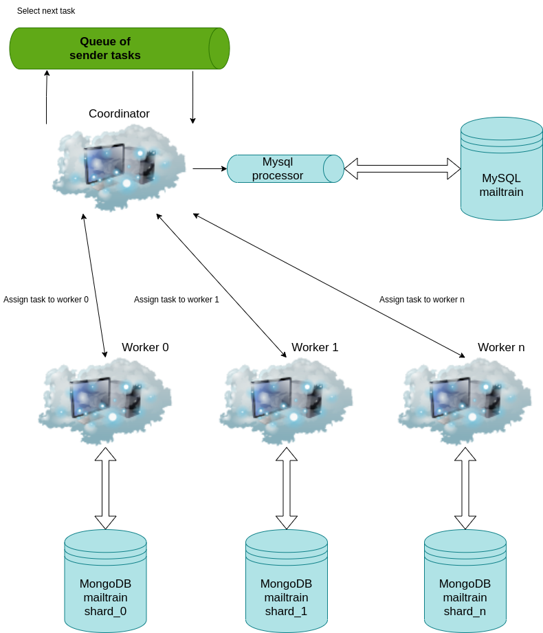

# Architecture shortcomings

In this chapter, we are going to describe the base shortcomings and limits that current architecture contains. It means describing the main bottlenecks in the current architecture, analyzing the components responsible for this. Finally, we will introduce the solution (it includes the distributed architecture of the whole application, distributed architecture for the database, and expected performance).

## The main bottlenecks

As we could expect, sending campaign emails takes the most time. Sender component is responsible for sending all campaign emails.

Here we can see the architecture of Sender component:

    

Here we can see the design of MySQL mailtrain database:

As we can see, the master process takes tasks from the queue (each task includes sending some email from any campaign) and send it balanced to each worker. A worker then makes the formatted email and sends it to the SMTP server which sends it to the receiver.

We have 3 main bottlenecks in our current architecture of Sender:

- Centralized MySQL: As we can see from the diagram, the first biggest bottleneck is in a situation, when all workers need to access to MySQL database.
- Centralized workers: The second bottleneck is that we have already parallel architecture of Sender which runs only on one machine. We have already reached the limit of Amdahl's law and further adding processes (workers) on one machine would only make the situation worse.
- SMTP server: The last bottleneck is in the current SMTP server, we use a centralized serial SMTP server for sending emails. So when workers make the whole email for sending, then all emails must wait for SMTP processing.

## Performance tests

For better analyzing each bottleneck described above we are going to look at data from the performance test:

|Workers         |Real time |Worker time |SMTP server time |
|----------------|----------|------------|-----------------|
|1 worker        |2565s     |2561.211s   | 1274.688s       |
|2 workers       |1249s     |1245.976s   | 620.598s        |
|3 workers       |708s      |704.504s    | 401.392s        |
|4 workers       |637s      |635.9s      | 320s            |
|10 workers      |274s      |270.876s    | 142.603s        |
|20 workers      |254s      |250.876s    | 120.603s        |
|30 workers      |282s      |275.876s    | 155.603s        |
|40 workers      |275s      |268.876s    | 172.603s        |
|50 workers      |295s      |286.876s    | 201.176s        |

Each test was run on Intel® Core™ i3-7100U CPU @ 2.40GHz × 4 CPU and one centralized serial SMTP server which was run on the same machine. In each test, we sent 44846 emails for one regular campaign. Real time is the exact time between the start of sending and after sending emails. Worker time is the average time which takes per one worker. SMTP server time is the exact time that takes just sending created and formatted emails. Worker time includes also SMTP server time.

From measured times we can see that real time can be divided in half, where the first half takes SMTP server (for a bigger amount of workers it is a little bit more but only because we use serial SMTP server) and the second half takes other worker computing. It includes mainly database accesses, creating the email, and other details.

Now we are going to look deep at the second half of worker time. This is the exact analysis of time that tells us which functions (queries) take the most time:

<ul>
    <li>processCampaignMessages took 310.076s (service/sender-worker.js)</li>
    <ul>
        <li>initByCampaignId took 6.901s (lib/message-sender.js)</li>
        <li>sendRegularCampaignMessage took 302.136s (lib/message-sender.js)</li>
        <ul>
            <li>sendMessage took 239.087s (lib/message-sender.js)</li>
            <ul>
                <li>getById took 29.538s (lib/subscriptions.js)</li>
                <li>_getMessage took 17.152s (lib/message-sender.js)</li>
                <li>getOrCreateMailer took 18.994s (lib/mailers.js)</li>
                <li>sendMassMail took 162.34s (lib/mailers.js)</li>
                <ul>
                    <li>nodemailer with testServer took 158.34s (nodemailer.js)</li>
                </ul>
            </ul>
        </ul>
    </ul>
</ul>

The test was run with 1 worker which sent 5000 emails, real time was approximately 312s. As we could expect, the most expensive queries are those which select data from the biggest tables (it means 'campaign_messages, subscription_i, ...).

## Architecture improvements

The best solution for solving all of these bottlenecks is to make all of these components distributed. Now we are going to describe solutions for each bottleneck.

### Distributed database

To solve the first bottleneck we need to make a distributed database for too big tables because queries to these tables take the most time. From the previous analysis, we know that it includes tables (campaign_messages, subscription_i, queued, ...). There are also a lot of small tables to which there are often sent queries (permissions, shares, settings, files, ...) but it takes a negligible amount of time. So it will stay at the centralized MySQL database. We will use MongoDB for horizontal scaling of our database.

TODO: add diagram

### Distributed workers

To solve the second bottleneck we need to create a cluster and enable horizontal scaling for workers as we can see on the diagram below. When we allocate enough workers on enough amount of computers then sending speeds up rapidly.

    

### Distributed SMTP server

Specific SMTP server selection depends only on a client's decision whether he will select some fast parallel and distributed SMTP server or something else. So this bottleneck we can't influence and in our result architecture we will assume that we use some
SMTP server which doesn't slow down sending emails.

